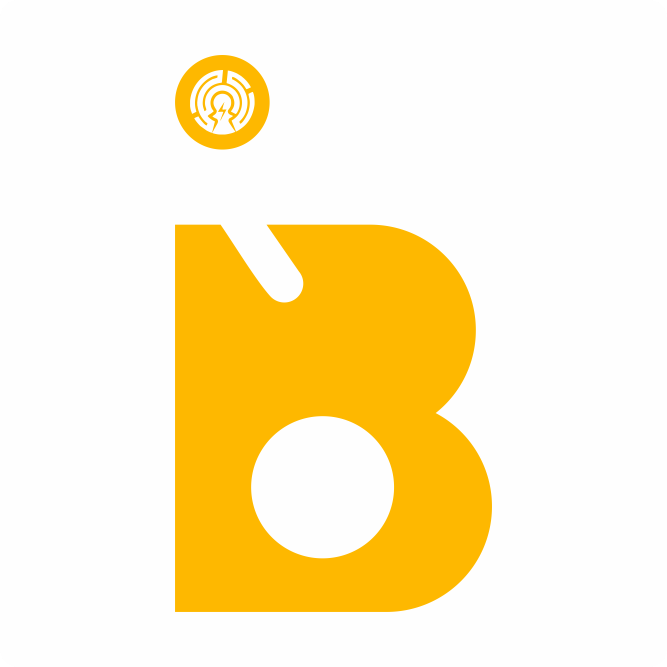

# 💰 BitSave — Multi-Chain Crypto Savings Vault for Farcaster



**BitSave** is a Farcaster MiniApp that empowers crypto users to save and earn yield on their digital assets without losing to market volatility. Built specifically for the Farcaster ecosystem, BitSave makes saving a social experience while providing secure, yield-generating vaults across multiple blockchain networks.

---

## 🌐 Platform Overview

### What is BitSave?

BitSave is a **Farcaster MiniApp** — a web application that runs natively within Farcaster clients like Warpcast. It leverages Farcaster's social graph and wallet infrastructure to create a seamless saving experience for crypto users.

### Farcaster Integration

- **Native MiniApp**: Built using the [Farcaster MiniApp SDK](https://miniapps.farcaster.xyz/)
- **Wallet Integration**: Direct integration with users' Farcaster wallets (no external wallet connections needed)
- **Social Features**: Share savings achievements as Farcaster casts
- **Identity**: Uses Farcaster profiles and social connections
- **Distribution**: Discoverable through Farcaster's MiniApp catalog

---

## 🔗 Supported Networks & Assets

### Base Network (Ethereum L2)

- **Chain ID**: 8453
- **Primary Token**: USDC (0x833589fCD6eDb6E08f4c7C32D4f71b54bdA02913)
- **Contract Address**: `0x3593546078eecd0ffd1c19317f53ee565be6ca13`
- **Gas Token**: ETH
- **Explorer**: [BaseScan](https://basescan.org/)

### Celo Network

- **Chain ID**: 42220
- **Supported Tokens**:
  - **cUSD** (0x765de816845861e75a25fca122bb6898b8b1282a): Celo Dollar
  - **USDGLO** (0x4f604735c1cf31399c6e711d5962b2b3e0225ad3): Global Dollar
- **Contract Address**: `0x7d839923Eb2DAc3A0d1cABb270102E481A208F33`
- **Gas Token**: CELO
- **Explorer**: [Celoscan](https://celoscan.io/)

---

## 🚀 Core Features

### 🏦 Savings Vault Creation

- **Custom Naming**: Personalize your savings goals
- **Multi-Network Support**: Choose between Base and Celo networks
- **Flexible Deposits**: Start with any amount (including $0)
- **Duration Controls**: Set saving periods with optional penalties for early withdrawal
- **Asset Selection**: Support for USDC, cUSD, USDGLO, and more

### 💸 Smart Top-Up System

- **Manual Deposits**: Add funds to your vault anytime
- **Earnings Detection**: Automatic monitoring of wallet activity
- **Smart Suggestions**: AI-powered recommendations based on earning patterns
- **Batch Operations**: Efficiently manage multiple savings plans

### 🔔 Intelligent Notifications

- **Wallet Activity Monitoring**: Track incoming payments and earnings
- **Contextual Prompts**: _"You earned $50 this week. Save 30% in your Emergency Fund?"_
- **Customizable Alerts**: Control notification frequency and types
- **Social Integration**: Option to share savings milestones

### 📢 Social Sharing

- **Cast Integration**: Share savings achievements as Farcaster casts
- **Achievement Badges**: Unlock and display saving milestones
- **Community Features**: Connect with other savers in your network
- **Referral System**: Earn rewards for bringing friends to BitSave

### 🥇 Leaderboard & Gamification

Track and compete with the community across multiple metrics:

- **Total Saved**: Lifetime savings across all vaults
- **Yield Earned**: Total returns generated
- **Vault Count**: Number of active savings plans
- **Consistency Score**: Regularity of saving habits

**Filter Options**:

- All users (global leaderboard)
- Friends only (social network)
- Network-specific (Base vs Celo)
- Time-based (weekly, monthly, all-time)

### ⚙️ Advanced Settings

- **Notification Controls**: Fine-tune alert preferences
- **Auto-Save** (Coming Soon): Automated percentage-based saving
- **Privacy Settings**: Control sharing and leaderboard visibility
- **Security Options**: Multi-signature and recovery settings

---

## 🏗️ Technology Stack

### Frontend Architecture

- **Framework**: [Next.js 15](https://nextjs.org/) with React 19
- **Styling**: [Tailwind CSS](https://tailwindcss.com/) with custom design system
- **Typography**: Space Grotesk font family
- **Animations**: [Framer Motion](https://www.framer.com/motion/) for smooth interactions
- **State Management**: React Query + Wagmi for blockchain state

### Blockchain Integration

- **Wallet Connection**: [Wagmi](https://wagmi.sh/) + Farcaster MiniApp Connector
- **Smart Contracts**: Solidity contracts deployed on Base and Celo
- **Web3 Libraries**:
  - [Ethers.js](https://docs.ethers.org/) for contract interactions
  - [Viem](https://viem.sh/) for typed blockchain operations
- **Chain Support**: Multi-chain architecture with network switching

### Farcaster Integration

- **SDK**: [@farcaster/miniapp-sdk](https://miniapps.farcaster.xyz/) v0.1.9
- **Authentication**: [@farcaster/auth-kit](https://docs.farcaster.xyz/auth-kit/) for Sign-in with Farcaster
- **Social Data**: [Neynar](https://neynar.com/) SDK for Farcaster data access
- **Wagmi Connector**: [@farcaster/miniapp-wagmi-connector](https://github.com/farcasterxyz/miniapps) for wallet integration

### Backend & Data

- **Database**: [MongoDB](https://www.mongodb.com/) with Mongoose ODM
- **API Routes**: Next.js API routes for server-side logic
- **External APIs**:
  - **Price Feeds**: Real-time token pricing across networks
  - **Wallet Activity**: Transaction monitoring and analysis
  - **Notifications**: Webhook-based alert system

### Development Tools

- **Package Manager**: PNPM for efficient dependency management
- **TypeScript**: Full type safety across the application
- **Linting**: ESLint with Next.js configuration
- **Formatting**: Prettier for consistent code style
- **Build**: Turbopack for fast development builds

---

## 🔧 Local Development

### Prerequisites

- **Node.js**: v18+ (recommended: v20+)
- **PNPM**: v8+ (or npm/yarn)
- **MongoDB**: Local instance or MongoDB Atlas
- **Farcaster Account**: For testing MiniApp features

### Quick Start

```bash
# Clone the repository
git clone https://github.com/CryptoSmartNow/bitsave-miniapp.git
cd bitsave-miniapp

# Install dependencies
pnpm install

# Set up environment variables
cp .env.example .env.local
# Edit .env.local with your configuration

# Run development server
pnpm dev
```

### Environment Configuration

Create a `.env.local` file with the following variables:

```env
# App Configuration
NEXT_PUBLIC_URL=http://localhost:3000
NEXT_PUBLIC_ENVIRONMENT=development

# Blockchain Networks
NEXT_PUBLIC_BASE_RPC_URL=https://mainnet.base.org
NEXT_PUBLIC_CELO_RPC_URL=https://forno.celo.org

# Smart Contract Addresses
NEXT_PUBLIC_BASE_VAULT_CONTRACT=0x3593546078eecd0ffd1c19317f53ee565be6ca13
NEXT_PUBLIC_CELO_VAULT_CONTRACT=0x7d839923Eb2DAc3A0d1cABb270102E481A208F33

# Database
MONGODB_URI=mongodb://localhost:27017/bitsave

# External APIs
NEYNAR_API_KEY=your_neynar_api_key
ALCHEMY_API_KEY=your_alchemy_api_key

# Farcaster Integration
NEXT_PUBLIC_FARCASTER_DEVELOPER_FID=your_fid
FARCASTER_DEVELOPER_MNEMONIC=your_mnemonic
```

### Available Scripts

```bash
# Development
pnpm dev          # Start development server with Turbopack
pnpm build        # Build for production
pnpm start        # Start production server
pnpm lint         # Run ESLint
pnpm format       # Format code with Prettier
pnpm ci           # Run CI checks (format + build)
```

### Testing MiniApp Features

1. **Local Development**: Use ngrok or similar tunneling service to expose localhost
2. **Farcaster Preview**: Test using [Farcaster's MiniApp preview tool](https://farcaster.xyz/~/developers/mini-apps/preview)
3. **Wallet Integration**: Connect using Farcaster's development wallet

---

## 📱 How It Works

### 1. **Vault Creation Flow**

```
User connects Farcaster wallet →
Selects network (Base/Celo) →
Chooses token (USDC/cUSD/USDGLO) →
Sets savings goal and duration →
Contract deployment →
Vault ready for deposits
```

### 2. **Earning Detection**

```
Webhook monitors wallet →
Detects incoming transactions →
Calculates earning patterns →
Triggers smart suggestions →
User can save percentage of earnings
```

### 3. **Yield Generation**

```
User deposits funds →
Smart contract allocates to yield strategies →
Interest compounds automatically →
User can withdraw principal + yield →
Penalty applied for early withdrawal (if set)
```

### 4. **Social Integration**

```
User achieves savings milestone →
Option to cast achievement →
Appears in Farcaster feed →
Friends can interact and be inspired →
Referral rewards distributed
```

---

## 🛡️ Security & Audits

### Smart Contract Security

- **Audited Contracts**: All vault contracts undergo security audits
- **Time Locks**: Critical functions protected by time delays
- **Multi-Signature**: Administrative functions require multiple signatures
- **Upgradeable Contracts**: Proxy pattern for secure upgrades

### Data Protection

- **No Private Keys**: All wallet operations through Farcaster's secure infrastructure
- **Encrypted Storage**: Sensitive user data encrypted at rest
- **HTTPS Only**: All communications secured with TLS
- **Privacy First**: Minimal data collection, user-controlled sharing

## 🤝 Contributing

We welcome contributions to BitSave! Here's how you can help:

### Development

1. Fork the repository
2. Create a feature branch
3. Make your changes
4. Add tests if applicable
5. Submit a pull request

### Bug Reports

- Use GitHub Issues for bug reports
- Include reproduction steps
- Provide browser/device information
- Include screenshots if relevant

### Feature Requests

- Open a GitHub Issue with the "enhancement" label
- Describe the use case and expected behavior
- Include mockups or examples if helpful

---

## 📜 License

MIT License © 2025 BitSave

Permission is hereby granted, free of charge, to any person obtaining a copy of this software and associated documentation files (the "Software"), to deal in the Software without restriction, including without limitation the rights to use, copy, modify, merge, publish, distribute, sublicense, and/or sell copies of the Software, and to permit persons to whom the Software is furnished to do so, subject to the following conditions:

The above copyright notice and this permission notice shall be included in all copies or substantial portions of the Software.

THE SOFTWARE IS PROVIDED "AS IS", WITHOUT WARRANTY OF ANY KIND, EXPRESS OR IMPLIED, INCLUDING BUT NOT LIMITED TO THE WARRANTIES OF MERCHANTABILITY, FITNESS FOR A PARTICULAR PURPOSE AND NONINFRINGEMENT.

---

**Start saving smarter today with BitSave — where crypto savings meets social incentives! 💰**
